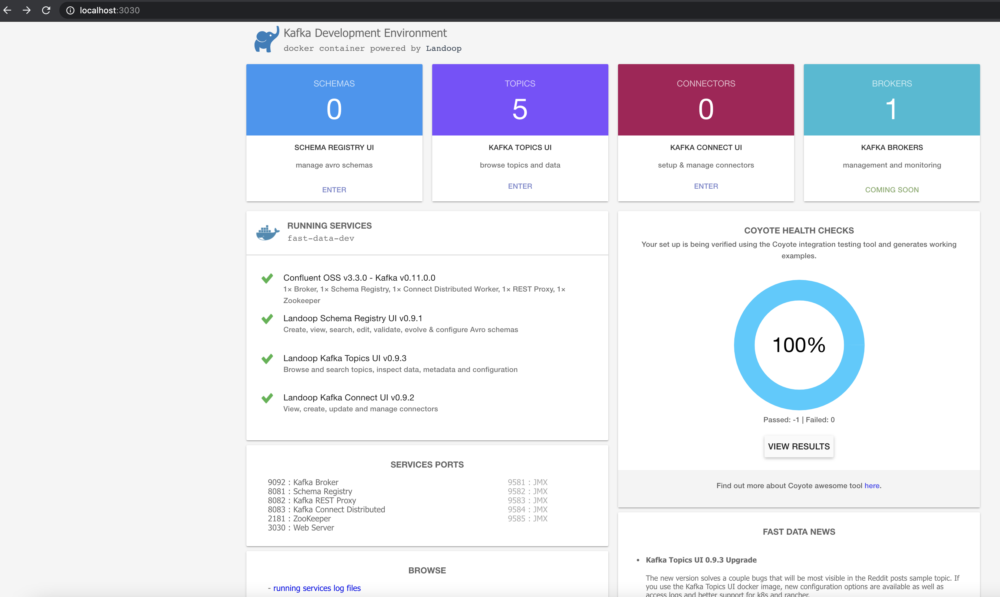
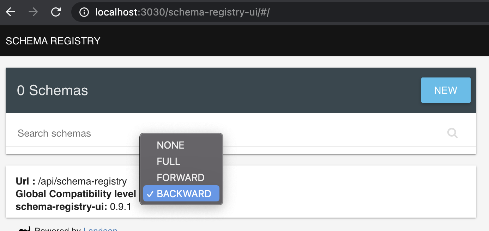
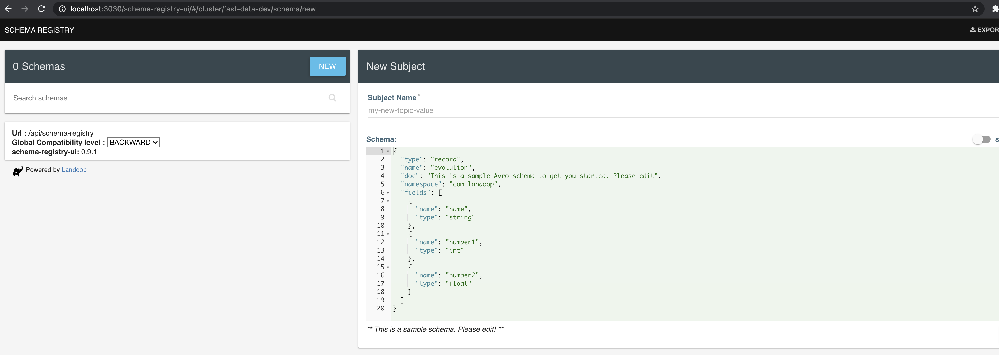
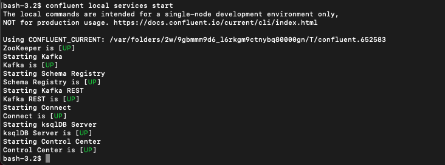
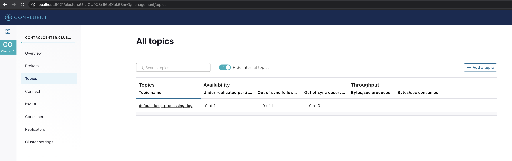
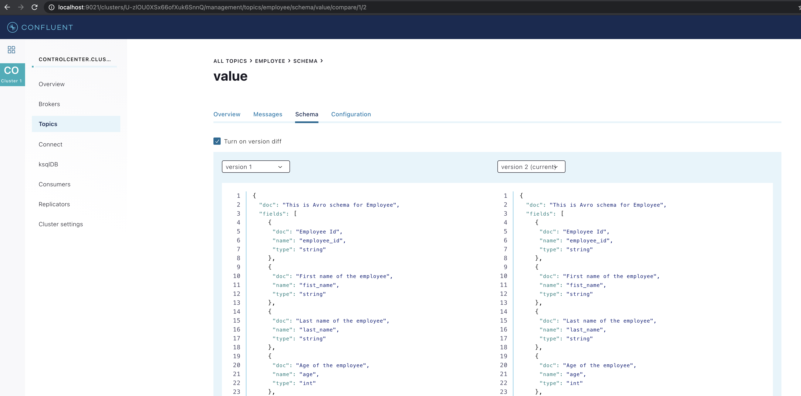

# Kafka Schema Registry

## About

This has samples of kafka producers and consumers with avro schema v2.

This is developed using java 8, avro 1.10.1, kafka 2.7.0, confluent 5.3.0, and docker 20.10.2 on Mac.

## Setup Kafka With Schema Registry
### Docker
* Install docker from ```https://www.docker.com/get-started```
* Start docker from applications
* Check docker status by running below commands in Terminal
  ```aidl
    docker --version
    docker-compose --version
    docker run hello-world
  ```
  Docker will download hello-world container and run it.
* Create docker-compose.yml file with below contents
  ```aidl
    version: '2'
    
    services:
      # this is our kafka cluster.
      kafka-cluster:
        image: landoop/fast-data-dev:cp3.3.0
        environment:
          ADV_HOST: 127.0.0.1         # Change to 192.168.99.100 if using Docker Toolbox
          RUNTESTS: 0                 # Disable Running tests so the cluster starts faster
          FORWARDLOGS: 0              # Disable running 5 file source connectors that bring application logs into Kafka topics
          SAMPLEDATA: 0               # Do not create sea_vessel_position_reports, nyc_yellow_taxi_trip_data, reddit_posts topics with sample Avro records.
        ports:
          - 2181:2181                 # Zookeeper
          - 3030:3030                 # Landoop UI
          - 8081-8083:8081-8083       # REST Proxy, Schema Registry, Kafka Connect ports
          - 9581-9585:9581-9585       # JMX Ports
          - 9092:9092                 # Kafka Broker
  ``` 
* Go to the directory where docker-compose.yml is created and run below command to start kafka cluster with schema registry
  ```aidl
    docker-compose up
  ``` 
* Open Landoop Web UI ```localhost:3030``` in browser.

  
  
* Enter to Schema Registry and set Compatibility Level to full
  
  

* Create new schema by clicking on New. Make sure that name of the value and key schema is <topic-name>-value <topic-name>-key resp.

  
 
### Confluent

* Follow the instructions from below linka dn start confluent control centre
  
  ```aidl
    https://docs.confluent.io/platform/current/quickstart/ce-quickstart.html#ce-quickstart
  ```
  
  
  
* Open the Control center web interface ```localhost:9021```, create topic and set topic schema

     
  
     

## How to run

* Start Consumer v1 from kafka-schema-registry-v1 repository
* Start Consumer v2 from kafka-schema-registry-v2 repository
* Run Producer V1 to produce message with schema v1
* Run Producer V2 to produce message with schema v2
* Check what Consumer V1 and V2 have consumed.
  
## Schema Operations
* Delete Schema
  ```aidl
    curl -X DELETE http://localhost:8081/subjects/employee-value
  ```   